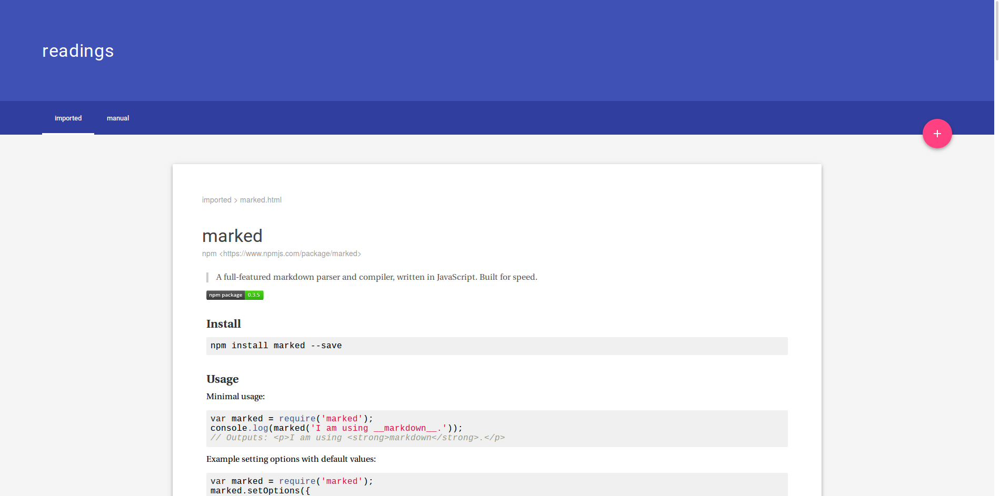

# readings
This application provides a way to organize a set of documents into categories and present them via a web interface. It uses a git repository as its data store (articles are markdown or html files), to allow collaborative work on things like project documentation, internal articles etc.



To get started, simply run the program as `readings`.
By default, the application assumes its working directory to be the underlying git repository (non-bare). You may specify a different directory by providing a single parameter:

```bash
readings /srv/documentation
```

The default port is 3000 but can be overriden by setting the `PORT` environment variable.

## The git repository
Your git repository will contain two top-level directories, `articles` and `tags`. Within the articles directory, an `imported` folder will be created, into which any articles added via the API (or the webinterface) will be placed. It is advised to place the repository on a server and have your maintainers/collaborators push to it instead of making direct changes.

### Categories
The directories within the articles folder will be treated as top-level categories, accessible via the main navigation of the frontend. Deeper nesting is possible and will be available as subcategories.

### Articles
An article is either an html or a markdown document located somewhere within the articles folder. Markdown files will be rendered to html when shown and html documents will be shown as-is. HTML will **not** be sanitized before serving, though we do sanitize anything imported via the API.
The file name provides the articles title and the person originally adding the file is determined by the author of the files first commit.
If you copied the article from somewhere on the web it is recommended to manually set the authors name on first commit. It is also advised to provide the source URL as the authors email address.

### Tags
You may symlink any article into an arbitrary number of tag folders. Tags can currently not be browsed directly via the web interface.

## The web interface
The web interface firstly gives you access to all currently added articles. In addition it gives you the ability to provide a URL to import articles from the web. When importing, it tries to extract the main article, allowing you to pick one of several best guesses. Then you may provide a title and the application will create a corresponding html file and commit it to your repository.

## API
The application exposes a REST API with the following routes:

### GET /api/tag
Returns a list of all tags:
```json
[
  "Documentation",
  "Best Practices",
  "Guidelines"
]
```

`populate` may be passed in the query string for full data:
```json
{
  "Documentation": {
    "src": "tags/Documentation",
    "name": "Documentation",
    "color": "#9ed22d",
    "articles": []
  },
  "Good Code": {
    "src": "tags/Good Code",
    "name": "Good Code",
    "color": "#783a50",
    "articles": [
      "CSS/Mediums CSS.html"
    ]
  },
  "Tutorial": {
    "src": "tags/Tutorial",
    "name": "Tutorial",
    "color": "#342d86",
    "articles": []
  }
}
```

The `src` is the location in the git repository of the element. The color is calculated by a hash function over the tag name and is calculated serverside to ensure consistent coloring across interfaces. `articles` is a list of identifiers of all articles this tag is assigned to.

### GET /api/tag/:name
Fetches a single tag.
```json
{
  "src": "tags/Good Code",
  "name": "Good Code",
  "color": "#783a50",
  "articles": [
    "CSS/Mediums CSS.html"
  ]
}
```

If `populate` is supplied, `articles` will be populated with the full article objects instead of their ids.

### GET /api/article
Fetches a list of articles.
```json
[
  "CSS/Mediums CSS.html"
]
```

If `populate` is supplied the full article objects are provided.

### GET /api/article/:path
Fetches a single article. The path has to contain the categories.
```json
{
  "src": "articles/CSS/Mediums CSS.html",
  "tags": [
    "Good Code"
  ],
  "type": "html",
  "author": {
    "name": "@fat",
    "url": "https://medium.com/@fat/mediums-css-is-actually-pretty-fucking-good-b8e2a6c78b06"
  },
  "title": "Mediums CSS",
  "content": "<div>Some HTML content</div>",
  "category": "CSS"
}
```

The type may be `html` or `markdown`. The author object will always contain the property `name` and in addition either `url` or `mail`, depending on if the authors email starts with `http`.
If `populate` is provided, the tags array as well as the category property will be filled with the objects instead of the ids of the corresponding values.

### GET /api/category
Fetches a list of all categories.
```json
[
  "CSS",
  "CSS/Examples",
  "JavaScript",
  "PHP",
  "PHP/Joomla",
  "PHP/WordPress",
  "TypeScript",
  "imported"
]
```

If `populate` is provided, the ids will be replaced by the complete category objects.

### GET /api/category/:path
Returns a specific category.
```json
{
  "src": "articles/CSS",
  "name": "CSS",
  "parent": null,
  "articles": [
    "CSS/Mediums CSS.html"
  ],
  "categories": [
    "CSS/Examples"
  ]
}
```

If `populate` is provided, the parent as well as all articles and categories are replaced by their full objects.

### GET /api/extract/:url
Tries to extract the main article from a given URL. Returns an array of best guesses. The guesses are provided as HTML strings. The HTML will be stripped of script and style tags as well as inline styles. In addition all links will be made absolute.

### POST /api/article
Adds an article to the git repository. The following querystring parameters should be provided:

`url`: The source URL of the article
`title`: The title of the article (and therefore file)
`author`: The name of the original author

The body of the request will be interpreted as html and sanitized in the same way as the fragments returned by `/api/extract`. A file will then be written to disk, corresponding to the title provided and a new commit will be created.

The body of the response will be exclusively comprised of the name of the added article (e.g. `/imported/Some%20Title.html`).
